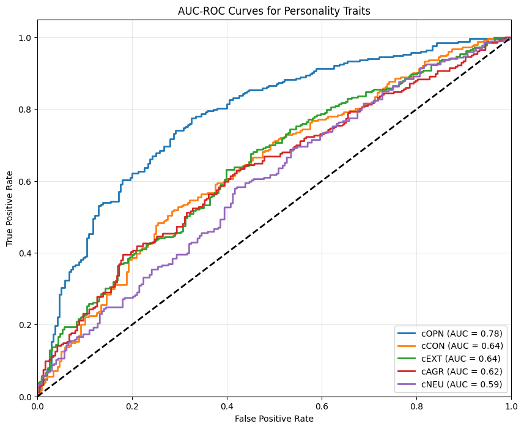

Absolutely! Here's the updated `README.md` section with your provided performance table rendered properly in Markdown format:

---

```markdown
# 🧠 Personality Traits Analysis using RoBERTa

This repository contains a Python-based application that analyzes personality traits using the RoBERTa language model. The model is fine-tuned to predict the Big Five personality traits (Openness, Conscientiousness, Extraversion, Agreeableness, Neuroticism) from textual data.

---

## 📁 Project Structure

```
personality_traits_analysis/
│
├── app.py                     # Main application script
├── requirements.txt           # Python dependencies
├── results/
│   ├── [BIG5]_RoBERTa_ver4.png    # Model performance visualization
│   └── performance_roberta.csv    # Performance metrics table
```

---

## ⚙️ Setup Instructions

To get started with this project on your local machine, follow the steps below:

### 1. Clone the Repository

```bash
git clone https://github.com/yourusername/personality_traits_analysis.git
cd personality_traits_analysis
```

### 2. Create a Virtual Environment (Optional but Recommended)

```bash
python -m venv venv
source venv/bin/activate    # On Windows: venv\Scripts\activate
```

### 3. Install Dependencies

```bash
pip install -r requirements.txt
```

---

## 🚀 How to Run the Program

To launch the analysis, simply execute:

```bash
python app.py
```

The script will run the RoBERTa model and output the predicted personality traits and model evaluation results.

---

## 📊 Model Performance

### 🔢 Performance Metrics Table

| Metrics / Score | cOPN  | cCON  | cEXT  | cAGR  | cNEU  | Average |
|-----------------|-------|-------|-------|-------|-------|---------|
| Accuracy        | 0.5142 | 0.5283 | 0.5486 | 0.5648 | 0.5385 | 0.5389 |
| Precision       | 0.5142 | 0.5216 | 0.5412 | 0.5562 | 0.5385 | 0.5343 |
| F1 Score        | 0.6791 | 0.6856 | 0.7023 | 0.6538 | 0.7000 | 0.6842 |
| Recall          | 1.0000 | 1.0000 | 1.0000 | 0.7930 | 1.0000 | 0.9586 |

---

### 📈 Performance Visualization

The following figure illustrates the performance of the RoBERTa model across all Big Five traits:

<p align="center">
  
</p>

---

## 📌 Notes

- Make sure you have Python 3.7 or higher installed.
- The model may take some time to run depending on your hardware.
- Modify `app.py` to test on your own text inputs or datasets.

---

## 📬 Contact

For questions or contributions, feel free to open an issue or pull request. You can also reach out via email or GitHub Discussions.

---

## 📄 License

This project is licensed under the [MIT License](LICENSE).
```

---

Let me know if you want me to help generate the actual LICENSE file or automate the visualization rendering!